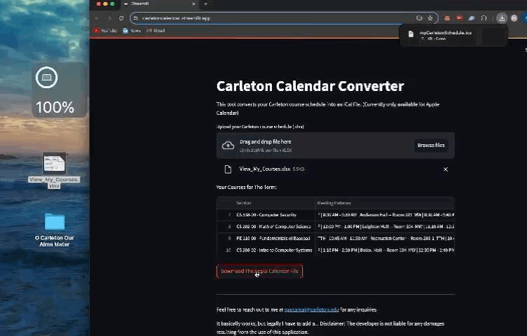

# [Carleton Calendar Converter](https://carletoncalendar.streamlit.app/)

It's basically a tool that allows you to easily convert your Carleton academic schedule from an Excel `.xlsx` file to an Apple Calendar `.ics` file.

## https://carletoncalendar.streamlit.app/

Click it to try.

## How It Works

1. **Upload Your Schedule**: Choose your Excel `.xlsx` file that contains your course schedule.
2. **Generate the Calendar**: The app processes your file and generates an `.ics` file.
3. **Download and Import**: Download the `.ics` file and import it into your Apple Calendar.

## Features

- **Excel to Calendar Conversion**: Converts your course schedule from an Excel file into an Apple Calendar-compatible `.ics` file.
- **Smart Filtering**: Effortlessly excludes dropped or withdrawn courses from your schedule, ensuring only your active classes with accurate start and end dates are included.
- **User-Friendly Interface**: Built using Streamlit for a simple and clean user experience.
- **Lightweight and Fast**: Get your calendar file in just a few clicks!

## Demo

Here is a demo of how the app looks in action:

Drag/Select your Courses Excel file, Then Click `Download the Apple Calendar File`.

Then Click on The Download and Press Ok.

## How To Find Your Schedule on Workday
Go to Academics and Registration -> Registration Planning -> View My Courses & Saved Schedules

## How To Download Your Schedule as an Excel `.xlsx` file

