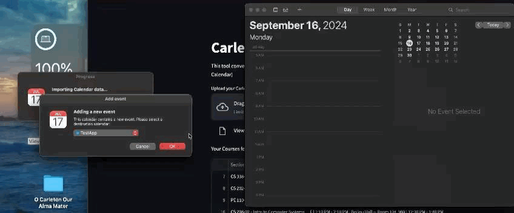

# [📆 Carleton Calendar Converter 🥏](https://carletoncalendar.streamlit.app/)

It's basically a tool that allows you to easily convert your Carleton academic schedule from an Excel `.xlsx` file to an Apple Calendar `.ics` file.



## Table of Contents
- [Why Did I Make This?](#why-did-i-make-this)
- [Features](#features)
- [How It Works / Tutorial](#how-it-works--tutorial)
- [Running It On Your Device Natively](#running-it-on-your-device-natively)
- [Contributing](#contributing)
- [It basically works, but legally I have to add a...Disclaimer](#it-basically-works-but-legally-i-have-to-add-adisclaimer)
- [Contact](#contact)

## Why Did I Make This?

Because I was too lazy to input my schedule into my calendar.

## Features

- **Excel to Calendar Conversion**: Converts your course schedule from an Excel file into an Apple Calendar-compatible `.ics` file.
- **Automatic Filtering**: Automatically excludes dropped or withdrawn courses from the schedule.
- **User-Friendly Interface**: Built using Streamlit for a simple and clean user experience.
- **Lightweight and Fast**: Get your calendar file in just a few clicks!

## How It Works / Tutorial

1. **Download Your Schedule as an Excel `.xlsx` file on Workday**: Go to Academics and Registration -> Registration Planning -> View My Courses & Saved Schedules


2. **Upload Your Schedule**: Choose the Excel `.xlsx` file that contains your course schedule.
3. **Generate the Calendar**: Click `Download the Apple Calendar File`, which processes your file and generates an `.ics` file.
4. **Download and Import**: Download the `.ics` file and import it into your Apple Calendar.


5. **Voila**: Click on The Download and Press Ok.


## Running It On Your Device Natively
1. Clone this repository to your local machine:
```bash
git clone https://github.com/johncassavetes/CarletonCalendarConverter.git
```
2. Navigate to the project direcotry:
```bash
cd CarletonCalendarConverter
```
3. Install the required packages:
```bash
pip install -r requirements.txt
```
4. Run the application with streamlit:
```bash
streamlit run app.py
```

## Contributing
1. **Fork the Repository**: Click the "Fork" button at the top right of this repository page to create a copy of this repository on your own GitHub account.
2. **Clone Your Fork**: Clone the forked repository to your local machine using the command below, replacing your-username with your GitHub username.
```bash
git clone https://github.com/your-username/CarletonCalendarConverter.git
```
3. **Create a New Branch**: Create a new branch for your feature or bug fix. Use a descriptive name for your branch.
```bash
git checkout -b feature-name
```
4. **Make Changes**: Implement your changes to the codebase. If you're adding a new feature, consider writing tests for it.
5. **Commit Your Changes**: Commit your changes with a descriptive commit message.
```bash
git add .
git commit -m "Add feature-name: brief description of your changes"
```
6. **Push Your Changes**: Push your changes to your forked repository.
```bash
git push origin feature-name
```
7. **Create a Pull Request**: Go to the original repository and create a pull request. Provide a clear description of the changes you made and any relevant information.
8. **Review and Merge**: Your pull request will be reviewed. Once everything looks good, your changes will be merged into the main repository.

## It basically works, but legally I have to add a...Disclaimer
This tool is provided "as-is" without any guarantees. The developer is not liable for any damages resulting from the use of this application. This project is not affiliated with Carleton College. 

## Contact
Feel free to reach out to me at gautamaj@carleton.edu for any inquiries.